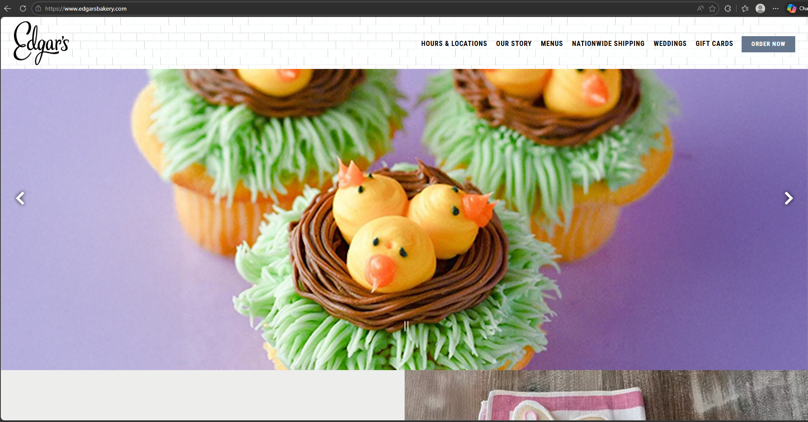

# Bakery Site

A small, responsive bakery storefront demo: menu, product details, and a simple ordering flow.

## Authorship & attribution

- Author: Thomas Brakefield (tcbrakefield2)
- Built with: HTML, CSS, JavaScript, bootstrap
- Resources / inspirations:
  - Chat GPT (Was used moderatly did not abuse, if needed will be happy to talk about uses.)
  - Youtube (When confused in areas AI could not assist.)
  - My girlfriends designs (Will be happy to elaborate if need be.)
  - Inspiration came from Edgars bakery

## Tagline

"A fresh task of baked goods with a hint of coldhard code." (Unclear if this is what you want, So did a whitty one liner!)

## User story

As a customer

I want to be able to view the menu, contact the bakery, and see the specials

So that I can order what I want from the bakery.

## Links & verification

- Repo: <https://github.com/tcbrakefield2/bakery_site_project-main>
- Deployed: <https://tcbrakefield2.github.io/bakery_site_project/index.html>
- Verification: Tested on Chrome (desktop), Safari (iOS); responsive on mobile and desktop.

